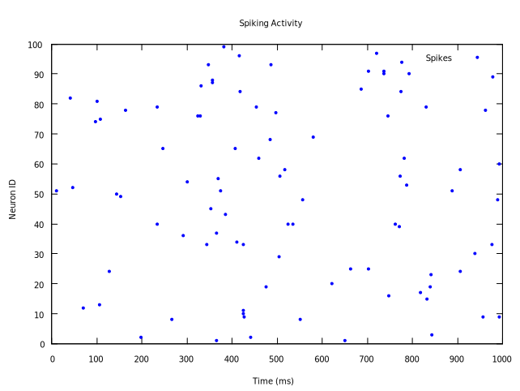

# Spiking Neural Network Simulator

A C++ simulation of a spiking neural network with 100 Leaky Integrate-and-Fire (LIF) neurons. The simulator supports both conductance-based and current-based synaptic models. Spiking activity is visualized using Gnuplot.



## Features

- Leaky Integrate-and-Fire neuron model
- Conductance-based and current-based synaptic dynamics
- Random sparse connectivity (binomial distribution)
- Spontaneous spiking with configurable probability
- Refractory mechanism
- Time-driven simulation with configurable resolution
- Spike raster plot output (`spikes.csv`) for visualization

## Dependencies

- C++17 compiler (e.g., GCC ≥ 7.0)
- CMake ≥ 3.10
- Gnuplot (for visualization)

## Building the Project

```shell
./make-make
```

This will:
- Create a `build/` directory
- Configure the project with CMake
- Compile the executable
- Copy the final `main` binary to the root directory

## Running the Simulation

```shell
./main
```

This generates `spikes.csv`, a CSV file containing spike time and neuron ID.

## Visualizing Spiking Activity

```shell
gnuplot -persist -e "
set datafile separator ',';
set title 'Spiking Activity';
set xlabel 'Time (ms)';
set ylabel 'Neuron ID';
set style data points;
plot 'spikes.csv' using 1:2 title 'Spikes' with points pt 7 ps 0.5 lc rgb 'blue'"
```

To export as SVG from within Gnuplot:

```shell
set terminal svg size 800,600
set output 'assets/images/plot.svg'
replot
```

## Parameters

| Parameter       | Description                                 | Value         |
|----------------|---------------------------------------------|---------------|
| `N`            | Number of neurons                          | 100           |
| `p`            | Connection probability                     | 0.1           |
| `V_rest`       | Resting potential (mV)                     | -70           |
| `V_th`         | Firing threshold (mV)                      | -55           |
| `τ_m`          | Membrane time constant (ms)                | 10            |
| `τ_s`          | Synaptic decay time (ms)                   | 5             |
| `τ_ref`        | Refractory period (ms)                     | 2             |
| `R_m`          | Membrane resistance (GΩ)                   | 0.1           |
| `E_rev`        | Synaptic reversal potential (mV)           | 0             |
| `g_s`          | Synaptic conductance step (nS)             | ~10           |
| `I_s`          | Synaptic current step (pA)                 | ~100          |
| `p_s`          | Spontaneous spike probability per step     | ~0.001        |

## License

This project is open source and available under the [MIT License](LICENSE).
